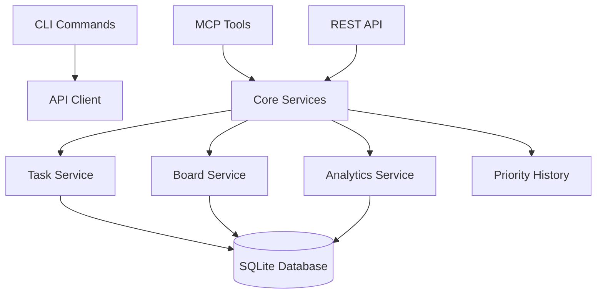

# Developer Guide

**MCP Kanban Board** - Comprehensive development setup and contribution guide

## Table of Contents

1. [Quick Start](#quick-start)
2. [Project Architecture](#project-architecture)
3. [Development Environment](#development-environment)
4. [Testing](#testing)
5. [Code Style & Standards](#code-style--standards)
6. [API Development](#api-development)
7. [Database & Migrations](#database--migrations)
8. [MCP Tools Development](#mcp-tools-development)
9. [CLI Command Development](#cli-command-development)
10. [Contributing](#contributing)
11. [Troubleshooting](#troubleshooting)

## Quick Start

### Prerequisites

- **Node.js**: 18.x or later
- **TypeScript**: 5.x
- **SQLite**: 3.x (included with Node.js)
- **Git**: Latest stable version

### Initial Setup

```bash
# Clone the repository
git clone <repository-url>
cd mcp-kanban

# Install dependencies
npm install

# Set up environment
cp .env.example .env
# Edit .env with your configuration

# Initialize database
npm run db:init

# Start development server
npm run dev

# In another terminal, start CLI development
npm run build
npm link
```

### Verify Installation

```bash
# Test CLI
kanban --version

# Test API
curl http://localhost:3000/api/health

# Test MCP tools
echo '{"tool": "list_tasks", "arguments": {}}' | node dist/mcp/server.js
```

## Project Architecture

### High-Level Structure

```
mcp-kanban/
├── src/
│   ├── cli/                 # Command-line interface
│   │   ├── commands/        # CLI command implementations
│   │   ├── services/        # CLI service layer
│   │   └── ui/             # Interactive UI components
│   ├── mcp/                # MCP server and tools
│   │   ├── tools.ts        # MCP tool registry
│   │   └── server.ts       # MCP server implementation
│   ├── services/           # Business logic layer
│   ├── routes/             # API route handlers
│   ├── middleware/         # Express middleware
│   ├── database/           # Database connection & migrations
│   ├── types/              # TypeScript type definitions
│   └── utils/              # Shared utilities
├── docs/                   # Documentation
├── tests/                  # Test suites
└── dist/                   # Compiled output
```

### Core Services Architecture



### Key Components

1. **CLI Layer**: User-facing command-line interface
2. **MCP Layer**: AI agent integration tools
3. **API Layer**: RESTful HTTP endpoints
4. **Service Layer**: Business logic and data operations
5. **Database Layer**: SQLite data persistence

## Development Environment

### Environment Variables

Create `.env` file:

```bash
# Database
DATABASE_PATH=./data/kanban.db
DATABASE_BACKUP_PATH=./data/backups

# API Server
PORT=3000
HOST=localhost
API_KEY_HEADER=X-API-Key

# Logging
LOG_LEVEL=debug
LOG_FORMAT=json

# Features
ENABLE_ANALYTICS=true
ENABLE_REALTIME=true
ENABLE_BACKUPS=true

# MCP
MCP_SERVER_PORT=3001
```

### Development Scripts

```bash
# Development
npm run dev              # Start with hot reload
npm run dev:api          # API server only
npm run dev:cli          # CLI development mode

# Building
npm run build            # Production build
npm run build:watch      # Build with watch mode

# Testing
npm test                 # Run all tests
npm run test:unit        # Unit tests only
npm run test:integration # Integration tests
npm run test:cli         # CLI tests
npm run test:coverage    # With coverage report

# Database
npm run db:init          # Initialize database
npm run db:migrate       # Run migrations
npm run db:seed          # Add sample data
npm run db:reset         # Reset to clean state

# Linting & Formatting
npm run lint             # ESLint check
npm run lint:fix         # Auto-fix issues
npm run format           # Prettier format
npm run type-check       # TypeScript check
```

### IDE Configuration

#### VS Code Settings

Create `.vscode/settings.json`:

```json
{
  "typescript.preferences.importModuleSpecifier": "relative",
  "editor.codeActionsOnSave": {
    "source.fixAll.eslint": true,
    "source.organizeImports": true
  },
  "editor.formatOnSave": true,
  "editor.defaultFormatter": "esbenp.prettier-vscode",
  "typescript.preferences.includePackageJsonAutoImports": "on"
}
```

#### Recommended Extensions

```json
{
  "recommendations": [
    "esbenp.prettier-vscode",
    "ms-vscode.vscode-typescript-next",
    "bradlc.vscode-tailwindcss",
    "ms-vscode.test-adapter-converter"
  ]
}
```

## Testing

### Test Structure

```
tests/
├── unit/                # Unit tests
│   ├── services/        # Service layer tests
│   ├── utils/           # Utility function tests
│   └── mcp/             # MCP tool tests
├── integration/         # Integration tests
│   ├── api/             # API endpoint tests
│   ├── cli/             # CLI command tests
│   └── database/        # Database operation tests
├── fixtures/            # Test data
└── helpers/             # Test utilities
```

### Writing Tests

#### Service Tests

```typescript
// tests/unit/services/TaskService.test.ts
import { TaskService } from '@/services/TaskService';
import { dbConnection } from '@/database/connection';

describe('TaskService', () => {
  let taskService: TaskService;

  beforeEach(async () => {
    taskService = new TaskService(dbConnection);
    await dbConnection.run('DELETE FROM tasks'); // Clean slate
  });

  it('should create a task with valid data', async () => {
    const taskData = {
      title: 'Test Task',
      board_id: 'board-123',
      status: 'todo' as const,
    };

    const task = await taskService.createTask(taskData);
    
    expect(task.id).toBeDefined();
    expect(task.title).toBe('Test Task');
    expect(task.status).toBe('todo');
  });
});
```

#### API Tests

```typescript
// tests/integration/api/tasks.test.ts
import request from 'supertest';
import { app } from '@/app';

describe('Tasks API', () => {
  it('GET /api/tasks should return tasks list', async () => {
    const response = await request(app)
      .get('/api/tasks')
      .set('X-API-Key', 'test-key')
      .expect(200);

    expect(response.body.status).toBe('success');
    expect(Array.isArray(response.body.data)).toBe(true);
  });
});
```

#### CLI Tests

```typescript
// tests/integration/cli/tasks.test.ts
import { execSync } from 'child_process';

describe('CLI Tasks', () => {
  it('should list tasks', () => {
    const output = execSync('kanban task list', { encoding: 'utf8' });
    expect(output).toContain('No tasks found');
  });
});
```

### Test Data & Fixtures

```typescript
// tests/fixtures/tasks.ts
export const sampleTasks = [
  {
    id: 'task-1',
    title: 'Sample Task 1',
    status: 'todo',
    priority: 5,
    board_id: 'board-1',
  },
  // ... more fixtures
];
```

## Code Style & Standards

### TypeScript Configuration

Key `tsconfig.json` settings:

```json
{
  "compilerOptions": {
    "strict": true,
    "exactOptionalPropertyTypes": true,
    "noImplicitReturns": true,
    "noFallthroughCasesInSwitch": true,
    "noImplicitOverride": true
  }
}
```

### ESLint Rules

Important rules in `.eslintrc.json`:

```json
{
  "rules": {
    "@typescript-eslint/no-unsafe-assignment": "error",
    "@typescript-eslint/no-unsafe-call": "error",
    "@typescript-eslint/no-unsafe-member-access": "error",
    "@typescript-eslint/no-floating-promises": "error",
    "@typescript-eslint/prefer-nullish-coalescing": "warn"
  }
}
```

### Coding Standards

#### Function Documentation

```typescript
/**
 * Creates a new task with the provided data.
 *
 * @param taskData - The task creation data
 * @returns The created task
 * @throws ValidationError when required fields are missing
 * @throws DatabaseError when database operation fails
 *
 * @example
 * ```typescript
 * const task = await taskService.createTask({
 *   title: 'New Task',
 *   board_id: 'board-123',
 *   status: 'todo'
 * });
 * ```
 */
async createTask(taskData: CreateTaskRequest): Promise<Task> {
  // Implementation
}
```

#### Error Handling

```typescript
// Good: Structured error handling
try {
  const result = await riskyOperation();
  return result;
} catch (error) {
  logger.error('Operation failed', { 
    operation: 'riskyOperation',
    error: error instanceof Error ? error.message : 'Unknown error'
  });
  throw new ServiceError('Failed to complete operation', { cause: error });
}

// Bad: Silent failures
try {
  await riskyOperation();
} catch {
  // Silent failure - don't do this
}
```

#### Type Safety

```typescript
// Good: Proper type guards
function isValidStatus(status: string): status is TaskStatus {
  return ['todo', 'in_progress', 'done', 'blocked'].includes(status);
}

// Good: Zod validation for external data
const TaskSchema = z.object({
  title: z.string().min(1).max(200),
  status: z.enum(['todo', 'in_progress', 'done', 'blocked']),
});

const validatedTask = TaskSchema.parse(userInput);
```

## API Development

### Route Structure

```typescript
// src/routes/tasks.ts
import { Router } from 'express';
import { z } from 'zod';
import { requirePermission } from '@/middleware/auth';
import { validateRequest } from '@/middleware/validation';

const router = Router();

// Schema validation
const CreateTaskSchema = z.object({
  title: z.string().min(1).max(200),
  description: z.string().optional(),
  // ... other fields
});

// Route with middleware
router.post(
  '/',
  requirePermission('write'),
  validateRequest(CreateTaskSchema),
  async (req, res, next) => {
    try {
      const taskData = req.body;
      const task = await taskService.createTask(taskData);
      res.apiSuccess(task);
    } catch (error) {
      next(error);
    }
  }
);
```

### Response Patterns

```typescript
// Success responses
res.apiSuccess(data);                    // 200 with data
res.status(201).apiSuccess(data);        // 201 for created
res.status(204).send();                  // 204 for no content

// Error responses (handled by middleware)
throw new ValidationError('Invalid input');
throw new NotFoundError('Task', taskId);
throw new DatabaseError('Connection failed');
```

### API Versioning

All routes should be prefixed with `/api/v1/`:

```typescript
// src/routes/index.ts
app.use('/api/v1/tasks', taskRoutes);
app.use('/api/v1/boards', boardRoutes);
```

## Database & Migrations

### Schema Design

```sql
-- migrations/001_initial_schema.sql
CREATE TABLE IF NOT EXISTS tasks (
  id TEXT PRIMARY KEY,
  title TEXT NOT NULL,
  description TEXT,
  status TEXT NOT NULL DEFAULT 'todo',
  priority INTEGER DEFAULT 5,
  board_id TEXT NOT NULL,
  parent_task_id TEXT,
  assignee TEXT,
  due_date DATETIME,
  estimated_hours REAL,
  created_at DATETIME DEFAULT CURRENT_TIMESTAMP,
  updated_at DATETIME DEFAULT CURRENT_TIMESTAMP,
  FOREIGN KEY (board_id) REFERENCES boards (id),
  FOREIGN KEY (parent_task_id) REFERENCES tasks (id)
);
```

### Migration System

```typescript
// src/database/migrations/001_initial_schema.ts
export async function up(db: Database): Promise<void> {
  await db.run(`
    CREATE TABLE IF NOT EXISTS tasks (
      -- schema definition
    )
  `);
  
  await db.run(`
    CREATE INDEX idx_tasks_board_id ON tasks (board_id)
  `);
}

export async function down(db: Database): Promise<void> {
  await db.run('DROP TABLE IF EXISTS tasks');
}
```

### Database Service Pattern

```typescript
// src/services/BaseService.ts
export abstract class BaseService {
  constructor(protected db: Database) {}

  protected async findById<T>(table: string, id: string): Promise<T | null> {
    const row = await this.db.get(
      `SELECT * FROM ${table} WHERE id = ?`,
      [id]
    );
    return row as T | null;
  }

  protected async findMany<T>(
    table: string,
    conditions: Record<string, any> = {}
  ): Promise<T[]> {
    const keys = Object.keys(conditions);
    const values = Object.values(conditions);
    
    let query = `SELECT * FROM ${table}`;
    if (keys.length > 0) {
      query += ` WHERE ${keys.map(key => `${key} = ?`).join(' AND ')}`;
    }
    
    const rows = await this.db.all(query, values);
    return rows as T[];
  }
}
```

## MCP Tools Development

### Tool Structure

```typescript
// src/mcp/tools.ts
export class MCPToolRegistry {
  private tools = new Map<string, MCPTool>();

  registerTool(name: string, tool: MCPTool): void {
    this.tools.set(name, tool);
  }

  async executeTool(name: string, args: Record<string, unknown>): Promise<unknown> {
    const tool = this.tools.get(name);
    if (!tool) {
      throw new Error(`Tool not found: ${name}`);
    }

    // Validate arguments
    const validatedArgs = tool.schema.parse(args);
    
    // Execute with proper error handling
    try {
      return await tool.execute(validatedArgs);
    } catch (error) {
      logger.error(`MCP tool execution failed: ${name}`, error);
      throw new MCPToolError(`Tool execution failed: ${name}`, { cause: error });
    }
  }
}
```

### Creating New Tools

```typescript
// Example: Add new MCP tool
const createTaskTool: MCPTool = {
  name: 'create_task',
  description: 'Create a new task in the kanban board',
  schema: z.object({
    title: z.string().min(1).max(200),
    board_id: z.string().uuid(),
    description: z.string().optional(),
    priority: z.number().int().min(1).max(10).optional(),
  }),
  
  async execute(args: {
    title: string;
    board_id: string;
    description?: string;
    priority?: number;
  }) {
    const taskService = new TaskService(dbConnection);
    
    const task = await taskService.createTask({
      title: args.title,
      board_id: args.board_id,
      description: args.description,
      priority: args.priority,
      status: 'todo',
    });

    return {
      success: true,
      task_id: task.id,
      message: `Task "${task.title}" created successfully`,
    };
  },
};

// Register the tool
registry.registerTool('create_task', createTaskTool);
```

## CLI Command Development

### Command Structure

```typescript
// src/cli/commands/example.ts
import { Command } from 'commander';
import chalk from 'chalk';
import { getCLIService } from '@/cli/services/ServiceContainer';

export function createExampleCommand(): Command {
  const cmd = new Command('example')
    .description('Example command description')
    .option('-f, --format <format>', 'Output format', 'table')
    .option('--json', 'Output as JSON')
    .action(async (options) => {
      try {
        const service = await getCLIService('exampleService');
        const result = await service.doSomething();

        if (options.json) {
          console.log(JSON.stringify(result, null, 2));
          return;
        }

        // Format output
        console.log(chalk.green('✅ Success!'));
        console.log(result);
      } catch (error) {
        console.error(chalk.red('❌ Error:'), error.message);
        process.exit(1);
      }
    });

  // Add subcommands
  cmd
    .command('subcommand <arg>')
    .description('Subcommand description')
    .action(async (arg: string) => {
      // Subcommand implementation
    });

  return cmd;
}
```

### Interactive Prompts

```typescript
// src/cli/ui/prompts.ts
import inquirer from 'inquirer';

export async function taskCreationPrompt(defaults = {}): Promise<TaskData> {
  const answers = await inquirer.prompt([
    {
      type: 'input',
      name: 'title',
      message: 'Task title:',
      validate: (input: string) => input.length > 0 || 'Title is required',
      default: defaults.title,
    },
    {
      type: 'list',
      name: 'priority',
      message: 'Priority:',
      choices: [
        { name: 'Critical (P1)', value: 'P1' },
        { name: 'High (P2)', value: 'P2' },
        { name: 'Medium (P3)', value: 'P3' },
        { name: 'Low (P4)', value: 'P4' },
      ],
      default: 'P3',
    },
  ]);

  return answers;
}
```

## Contributing

### Development Workflow

1. **Fork & Clone**: Fork the repository and clone your fork
2. **Branch**: Create a feature branch (`git checkout -b feature/amazing-feature`)
3. **Develop**: Make your changes following the coding standards
4. **Test**: Run tests and ensure they pass (`npm test`)
5. **Lint**: Run linting and fix issues (`npm run lint:fix`)
6. **Commit**: Use conventional commit format
7. **Push**: Push to your fork
8. **PR**: Create a pull request

### Commit Messages

Follow conventional commits:

```bash
# Features
feat: add task dependency visualization
feat(cli): add interactive task selection

# Bug fixes
fix: resolve memory leak in websocket connections
fix(api): correct task filtering logic

# Documentation
docs: update developer setup guide
docs(api): add examples for task endpoints

# Refactoring
refactor: extract priority calculation logic
refactor(db): optimize task query performance

# Tests
test: add integration tests for task API
test(cli): add tests for priority commands
```

### Pull Request Guidelines

1. **Description**: Clear description of changes
2. **Testing**: Include tests for new features
3. **Documentation**: Update docs if needed
4. **Breaking Changes**: Note any breaking changes
5. **Screenshots**: For UI changes, include screenshots

### Code Review Checklist

- [ ] Code follows project style guidelines
- [ ] Tests are written and passing
- [ ] Documentation is updated
- [ ] No obvious security vulnerabilities
- [ ] Performance impact considered
- [ ] Error handling is appropriate
- [ ] Type safety maintained

## Troubleshooting

### Common Issues

#### Database Locked Error

```bash
# Solution: Close all connections and restart
npm run db:reset
rm -f data/kanban.db-wal data/kanban.db-shm
npm run db:init
```

#### TypeScript Compilation Errors

```bash
# Check for type issues
npm run type-check

# Clear build cache
rm -rf dist/
npm run build
```

#### CLI Command Not Found

```bash
# Reinstall globally
npm unlink kanban  # If previously linked
npm run build
npm link
```

#### Permission Errors

```bash
# Fix file permissions
chmod +x bin/kanban
chmod -R 755 data/
```

### Debug Mode

Enable debug logging:

```bash
export LOG_LEVEL=debug
export DEBUG=kanban:*
npm run dev
```

### Performance Profiling

```bash
# Profile CLI commands
NODE_ENV=development node --prof dist/cli/index.js task list

# Analyze database queries
SQLITE_DEBUG=1 npm run dev
```

### Getting Help

1. **Check Documentation**: Review this guide and API docs
2. **Search Issues**: Look for existing GitHub issues
3. **Create Issue**: Open a new issue with details
4. **Discord/Chat**: Join our developer chat (if available)

---

## Additional Resources

- [API Documentation](./api/README.md)
- [MCP Protocol Specification](https://spec.modelcontextprotocol.io/)
- [TypeScript Best Practices](https://typescript-eslint.io/docs/)
- [SQLite Documentation](https://sqlite.org/docs.html)

---

**Happy coding! 🚀**

*Last updated: $(date)*